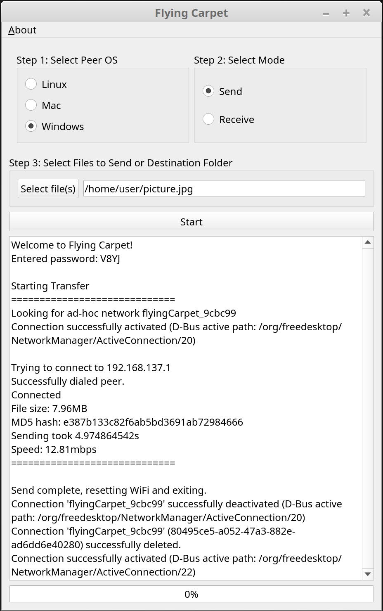

# Flying Carpet

To download, visit the [releases](https://github.com/spieglt/FlyingCarpet/releases) page!

Wireless, encrypted file transfer over automatically configured ad hoc networking. No network infrastructure required (access point, router, switch). Just two laptops (Mac, Linux, and Windows supported) with wireless chips in close range.

Don't have a flash drive? Don't have access to a wireless network or don't trust one? Need to move a file larger than 2GB between different filesystems but don't want to set up a file share? Try it out!

# Screenshots:

  

# Features:

+ Cross-platform: Linux, Mac, and Windows.

+ Transfer multiple files at once, without losing progress if the transfer is interrupted or canceled.

+ Drag and drop files and/or folders onto the window to select (except on Windows).

+ Speeds over 120mbps (with laptops close together).

+ Does not use Bluetooth or your local network, just wireless chip to wireless chip.

+ Files encrypted in transit.

+ Large files supported (<10MB RAM usage while transferring a 4.5GB file).

+ No installation required and no dependencies needed.

+ Interoperable GUI and CLI versions.

# GUI Use:

**Mac:** unzip `FlyingCarpetMac.zip` to find an `.app` bundle. You'll have to right-click and select `Open` to run because it's not code-signed or distributed through the App Store.

**Linux:**
```
unzip FlyingCarpetLinux.zip
chmod +x ./FlyingCarpet/flyingcarpet
./FlyingCarpet/flyingcarpet
```

**Windows:** extract `FlyingCarpetWindows.zip`, open the resulting folder, and run `flyingcarpet.exe`. You may have to click `More Info` to get past the Windows SmartScreen filter. You may also need to disable WiFi Sense.

# GUI Compilation instructions:

+ `go get -x github.com/spieglt/flyingcarpet`

+ Windows only: Open `flyingcarpet\WFD_DLL\WFD_DLL.sln` with Visual Studio, and compile in Release mode for x64.

+ If compiling on Windows, get `mt.exe` (available in Windows SDKs) and make sure it's in your path.

+ Go through the entire setup guide for [therecipe/qt](https://github.com/therecipe/qt/wiki/Installation) and make sure `qtdeploy` is in your path. (Use the sections of the installation guide with header `In Module (per project) mode`. Working commands can also be found in `gui/qtSetupCommands.txt` in this repo.)

+ Run `.\wg_rebuild.ps1` from Powershell (for Windows), `./mg_rebuild` from Terminal (for Mac), or `./lg_rebuild` (for Linux).

# CLI Compilation instructions

+ `go get -x github.com/spieglt/flyingcarpet`

+ Windows only: Open `flyingcarpet\WFD_DLL\WFD_DLL.sln` with Visual Studio, and compile in Release mode for x64. Then copy `flyingcarpet/WFD_DLL/x64/Release/WFD_DLL.dll` to `flyingcarpet/core/wfd.dll`.

+ `cd $GOPATH/src/github.com/spieglt/flyingcarpet/cli`

+ `go build -o flyingcarpet.exe`

# Restrictions:

+ 64-bit only.

+ Disables your wireless internet connection while in use (does not apply to Windows when receiving).

+ Drag-and-drop does not work on Windows because Flying Carpet requires administrator privileges on Windows and files cannot be dragged between processes of different privilege level. [See more.](https://social.msdn.microsoft.com/Forums/en-US/2fa935cf-be57-4bcc-9b96-7ee5a6b2b7a5/drag-n-drop-files-in-vista-rc1?forum=windowsuidevelopment)

+ Flying Carpet no longer works between two Macs if the receiving end is running Big Sur because Apple [deprecated the necessary ad hoc WiFi functions](https://developer.apple.com/documentation/corewlan/cwinterface/1426417-startibssmode). Use AirDrop instead. Mac-to-Windows and Mac-to-Linux still work as the Linux or Windows side will always host the network.

+ Flying Carpet should rejoin you to your previous wireless network after a completed or canceled transfer. This will not happen if the program freezes, crashes, or if the windows is closed during operation.

# Planned features:

+ Mobile versions, integrating functionality from https://github.com/claudiodangelis/qr-filetransfer.

If you've used Flying Carpet, please send me feedback! Thank you for your interest!
