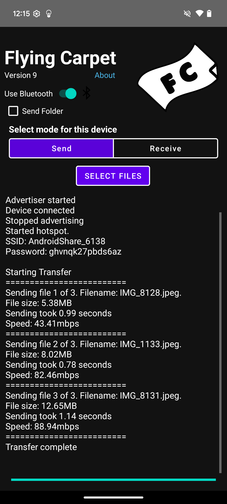
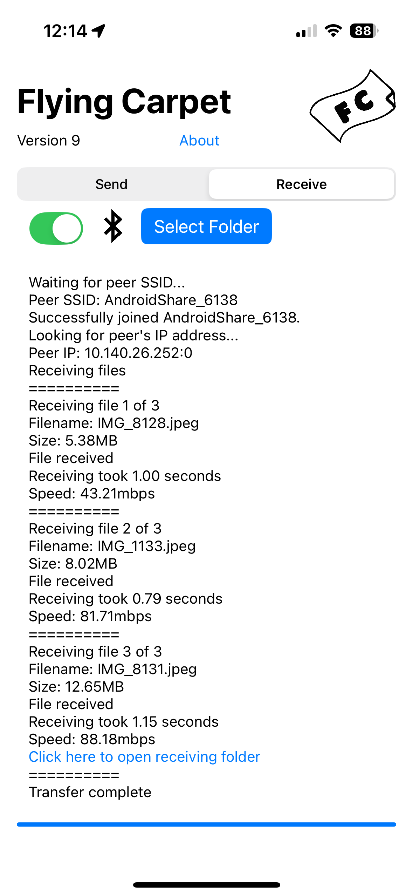
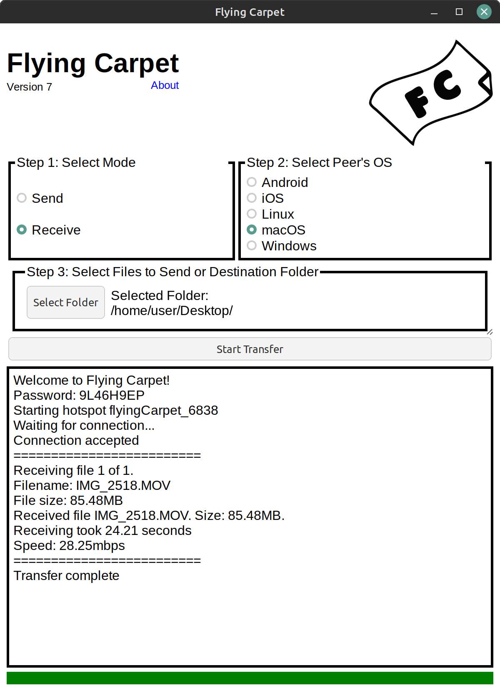
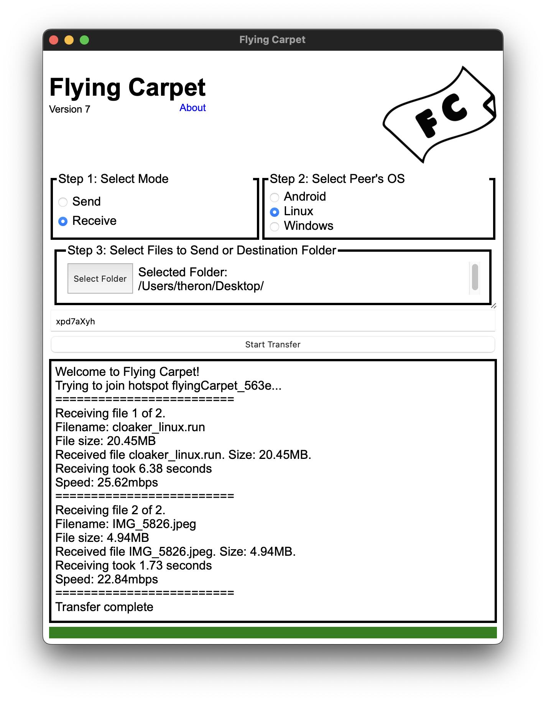
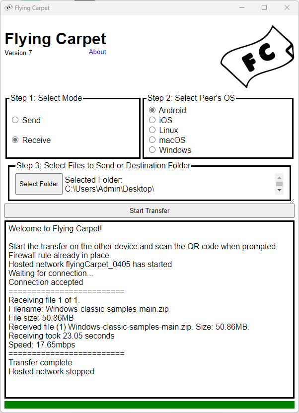

## Version 9 adds Bluetooth for transfer negotiation

### Download for Android:

<a href="https://play.google.com/store/apps/details?id=dev.spiegl.flyingcarpet"></a>&nbsp;&nbsp;<a href="https://f-droid.org/packages/dev.spiegl.flyingcarpet"></a>

Or if you prefer to sideload, `android_FlyingCarpet_9.0.0.apk` is available on the [releases](https://github.com/spieglt/FlyingCarpet/releases) page.

### Download for iOS:

<a href="https://apps.apple.com/us/app/flying-carpet-file-transfer/id1637377410"></a>

Or search the App Store for "Flying Carpet File Transfer".

### Linux, macOS, and Windows versions are available on the [releases](https://github.com/spieglt/FlyingCarpet/releases) page. Installers and standalone executable versions available.

# Flying Carpet

Send and receive files between Android, iOS, Linux, macOS, and Windows over ad hoc WiFi. No shared network or cell connection required, just two devices with WiFi (and optionally Bluetooth) chips in close range.

Don't have a flash drive? Don't have access to a wireless network? Need to move a file larger than 2GB between different filesystems but don't want to set up a network share? Try it out!

[Demo video](https://youtu.be/-RKiSmo-Bns)

## Screenshots:

   <br>  

## Use:

**Linux:** Download the `.AppImage` file from the [releases](https://github.com/spieglt/FlyingCarpet/releases) page for a standalone version, or if you're on a Debian-based distribution, download the `.deb` file and install it with `apk` or `dpkg`.

**macOS:** Download the `.dmg` disk image file from the [releases](https://github.com/spieglt/FlyingCarpet/releases) page. Double-click to mount it and drag the `.app` bundle inside to your Applications folder. Or if you use Homebrew, run `brew install flying-carpet`.

**Windows:** Download the `.msi` installer from the [releases](https://github.com/spieglt/FlyingCarpet/releases) page, or `FlyingCarpet.exe` for a standalone version.

## Compilation Instructions:

+ Install [Rust](https://www.rust-lang.org/tools/install).

+ Run `cargo install tauri-cli` to install Tauri.

+ For Linux, install dependencies. Ubuntu 20 example:
```
sudo apt install libsoup2.4* libjavascriptcoregtk* libgdk-pixbuf2.0* librust-pango-sys-dev libgdk3.0* librust-atk-dev librust-atk-sys-dev librust-gdk* libwebkit2gtk* librsvg2-dev
```

+ Run `cargo tauri dev` to run a development version or `cargo tauri build` to create release artifacts.

## Restrictions:

+ Apple devices can only transfer to/from Android, Linux, and Windows as they can no longer programmatically run hotspots. Use AirDrop instead for Apple-to-Apple transfers.

+ To use Bluetooth to send from macOS to Linux, the devices must be manually paired first, with the connection initiated by macOS[^1]. The "Use Bluetooth" switch can be turned off on both sides of the transfer when sending from macOS to Linux, to enter the WiFi information manually instead.

+ Disables your wireless internet connection while in use. (Does not apply to Windows or Android when hosting the hotspot.)

+ macOS sometimes switches back to a wireless network with internet connectivity during particularly long transfers.

+ The Android version requires at least Android 10/API level 29. The Android version does not work on some Xiaomi, MIUI, or HarmonyOS devices, and possibly other Android-like OSes. I don't own these devices and so can't test, but it seems like this is due to lack of support for the [LocalOnlyHotspot](https://developer.android.com/develop/connectivity/wifi/localonlyhotspot) API. It has been confirmed to work on at least one Xiaomi phone.

+ Requires Windows 10 or later.

+ The Linux version was developed and tested on Linux Mint. I mainly intend for it to run on Debian-based distributions. I will try to help troubleshoot others if I can, but I may not be able to as I don't have access to spare machines. There has been at least one [issue](https://github.com/spieglt/FlyingCarpet/issues/64) running on Fedora, possibly to SELinux but I don't really know.

+ Sometimes when the Cancel button is hit on the desktop platforms, it can take time for the OS to finish trying to join or create a hotspot. Please only click the Cancel button once and wait a few seconds. This sounds like it should be easy to fix, but last time I tried it was not.

## Planned Features

+ Add Flying Carpet shortcut to iOS Share menu.

## Questions That Could Be Asked at Some Point:

+ **Wasn't this a Go repo?** Yes, carcinization has come for the gopher. There were several issues I didn't know how to solve in the Go/Qt paradigm, especially with Windows: not being able to make a single-file executable, needing to Run as Administrator, and having to write the WiFi Direct DLL to a temp folder and link to it at runtime because Go doesn't work with MSVC. Plus it was fun to use `tokio`/`async` and `windows-rs`, with which the Windows networking portions are written. The GUI framework is now Tauri which gives a native experience on all platforms with a very small footprint. The Android version is written in Kotlin and the code is in this repository. The iOS and macOS versions are written in Swift and that codebase is not public.

+ **You're using SHA-256 to derive the key from a password. Isn't that bad? Shouldn't you be using a Password-Based Key Derivation Function like Scrypt or Argon2?** I was doing this before, but it wasn't strictly necessary because these keys are only used during the file transfer. For an attacker to intercept the data in transit, they'd need to be on the hotspot network, which is protected by WPA2, so they'd need to shoulder-surf the password or QR code. The change to SHA-256 was made because I couldn't find a good Scrypt or Argon2 implementation on all platforms when I added the mobile versions.

+ **Why are you using AES-GCM at all if there's already WPA2 then?** When I started working on this project in 2017, I was trying to allow for IBSS WiFi networks on macOS that didn't use authentication. I was using the wrong encryption (and incorrectly) then, and later I added AES-GCM because it's the only good and official-ish AEAD implementation I could find in all of Go, Swift, Kotlin, and now Rust. If any cryptographers read this and find that I'm still being dumb, please let me know.

## Complaints at Apple

+ Requiring location permissions to use `scanForNetworks(withSSID:)` but not mentioning it in the [documentation](https://developer.apple.com/documentation/corewlan/cwinterface/scanfornetworks(withssid:)) is annoying.

+ There should be a way to programmatically start hotspots, or at least read the current hotspot configuration with the user's permission.

If you've used Flying Carpet, please send feedback to theron@spiegl.dev. Thanks for your interest! Please also check out https://github.com/spieglt/cloaker, https://cloaker.mobi, and https://github.com/spieglt/whatfiles.

[^1]: Flying Carpet has the sending end of the transfer act as the Bluetooth LE peripheral (GATT server). MacOS, when acting as peripheral, does not seem to like the pairing process to be initiated before the BLE central device tries to read an encrypted characteristic, and when this happens, the central device cannot enumerate its GATT services. This can be worked around with the Windows and Android Bluetooth libraries by connecting without pairing, but the Linux library does not seem to be able to do this. The iOS version works with Linux when acting as a peripheral, and uses the same CoreBluetooth code. If you know more information about this problem, please let me know.
