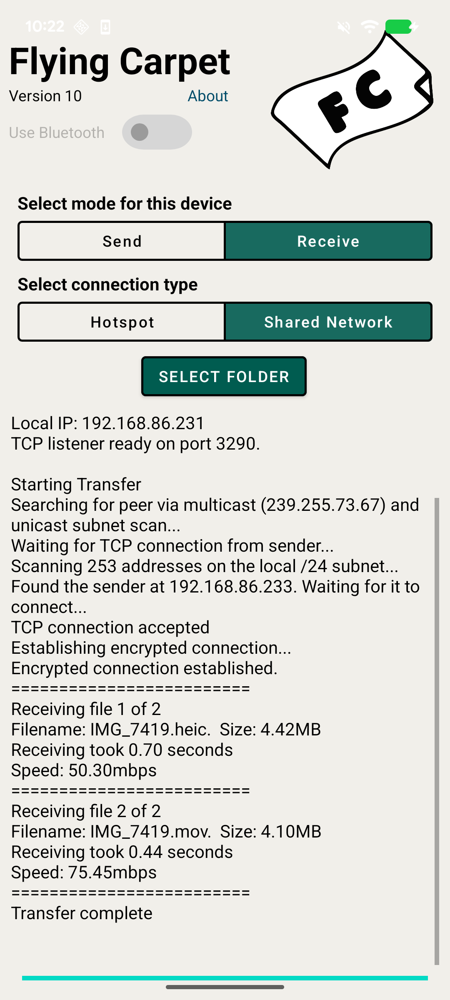
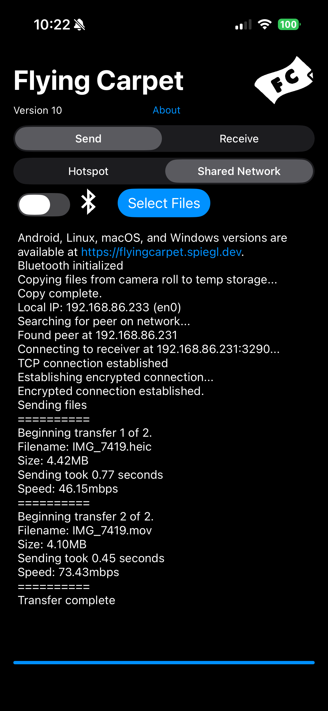
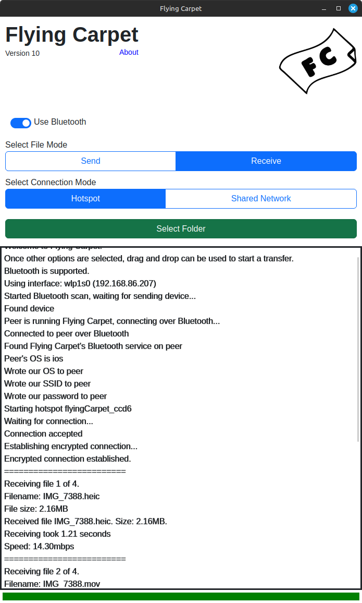
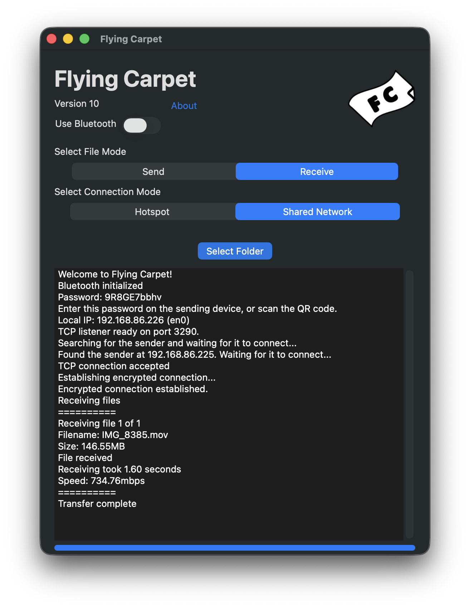
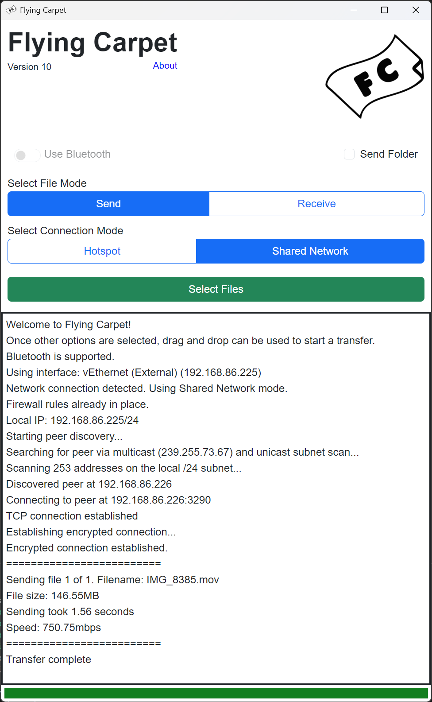

## Version 10 adds a Shared Network mode, for when you want to use a preexisting WiFi or wired network rather than create a hotspot.

**Version 10 is a breaking change:** devices running version 10 cannot transfer with version 9 or earlier — you'll get a version-mismatch message instead. Update Flying Carpet on every device you transfer between.

### Download for Android:

<a href="https://play.google.com/store/apps/details?id=dev.spiegl.flyingcarpet"></a>&nbsp;&nbsp;<a href="https://f-droid.org/packages/dev.spiegl.flyingcarpet"></a>

Or if you prefer to sideload, the APK is available on the [releases](https://github.com/spieglt/FlyingCarpet/releases/latest) page.

### Download for iOS:

<a href="https://apps.apple.com/us/app/flying-carpet-file-transfer/id1637377410"></a>

Or search the App Store for "Flying Carpet File Transfer".

### Linux, macOS, and Windows versions are available on the [releases](https://github.com/spieglt/FlyingCarpet/releases/latest) page. Installers and standalone executable versions available.

# Flying Carpet

Send and receive files between Android, iOS, Linux, macOS, and Windows: either over ad hoc WiFi with one device acting as hotspot, or over a network shared by both devices. No internet or cell connection required, just two devices with WiFi or ethernet (and optionally Bluetooth) chips (in close range if using hotspot mode).

Don't have a flash drive? Don't have access to a wireless network? Need to move a file larger than 2GB between different filesystems but don't want to set up a network share? Try it out!

[Demo video](https://youtu.be/52Xkrx2BXrg) (predates version 10 — it shows hotspot mode only)

## Screenshots:

   <br>  

## Use:

**Linux:** Download the `.AppImage` file from the [releases](https://github.com/spieglt/FlyingCarpet/releases) page for a standalone version, or if you're on a Debian-based distribution, download the `.deb` file and install it with `dpkg`.

**macOS:** Download the `.dmg` disk image file from the [releases](https://github.com/spieglt/FlyingCarpet/releases) page. Double-click to mount it and drag the `.app` bundle inside to your Applications folder. Or if you use Homebrew, run `brew install flying-carpet`.

**Windows:** Download the `.msi` installer from the [releases](https://github.com/spieglt/FlyingCarpet/releases) page, or `FlyingCarpet.exe` for a standalone version.

**Shared Network mode:** join both devices to the same network (WiFi or wired — a phone on WiFi can transfer with a desktop on ethernet), pick Shared Network mode and a direction on each device, and select what to send. The receiving device generates a one-time password and displays it with a QR code; type it on the sending device or scan it with a phone, and the devices find each other on the network and start the transfer. No Bluetooth is used and you don't need to know the other device's operating system.

**Hotspot mode:** one device creates an ad hoc WiFi hotspot for the other to join. If both devices can use Bluetooth, they exchange the hotspot credentials automatically after you confirm a pairing code; otherwise the hosting device displays the password (and a QR code) to enter on the joining device.

## Compilation Instructions:

+ Install [Rust](https://www.rust-lang.org/tools/install).

+ Run `cargo install tauri-cli` to install Tauri.

+ For Linux, install dependencies. Ubuntu 20 example:
```
sudo apt install libsoup2.4* libjavascriptcoregtk* libgdk-pixbuf2.0* librust-pango-sys-dev libgdk3.0* librust-atk-dev librust-atk-sys-dev librust-gdk* libwebkit2gtk* librsvg2-dev
```

+ Run `cargo tauri dev` to run a development version or `cargo tauri build` to create release artifacts.

That builds the Windows and Linux desktop app. The Android and Apple apps are separate builds from the same repo:

+ **Android:** from `Android/FlyingCarpet/`, run `./gradlew assembleDebug`, or open the directory in Android Studio.

+ **iOS and macOS:** requires a Mac with Xcode. Open `Apple/iOS/FlyingCarpet.xcodeproj` or `Apple/macOS/FlyingCarpet.xcodeproj`. `DEVELOPMENT_TEAM` is intentionally left blank, so the first build fails with "Signing for 'FlyingCarpet' requires a development team" — pick your own team under the target's Signing & Capabilities tab, or pass `DEVELOPMENT_TEAM=YOURTEAMID` to `xcodebuild`. The Swift code is an independent port of the protocol and shares no code with the Rust core, so `cargo build` does not touch it.

## Restrictions:

+ Apple devices cannot programmatically run hotspots, so Apple-to-Apple transfers require a shared network: join both devices to the same WiFi network and use shared network mode. That network can itself be a Personal Hotspot made manually on one iPhone or MacBook and joined from another before running the Flying Carpet transfer in Shared Network mode. (Or just use AirDrop.)

+ Disables your wireless internet connection while in use. (Does not apply in shared network mode, or to Windows or Android when hosting the hotspot.)

+ macOS sometimes switches back to a wireless network with internet connectivity during particularly long transfers.

+ The Android version requires at least Android 10/API level 29. The Android version does not work on some Xiaomi, MIUI, or HarmonyOS devices, and possibly other Android-like OSes. I don't own these devices and so can't test, but it seems like this is due to lack of support for the [LocalOnlyHotspot](https://developer.android.com/develop/connectivity/wifi/localonlyhotspot) API. It has been confirmed to work on at least one Xiaomi phone.

+ Requires Windows 10 or later.

+ The Linux version was developed and tested on Linux Mint. I mainly intend for it to run on Debian-based distributions. I will try to help troubleshoot others if I can, but I may not be able to as I don't have access to spare machines. There has been at least one [issue](https://github.com/spieglt/FlyingCarpet/issues/64) running on Fedora, possibly related to SELinux but I don't really know.

+ Sometimes when the Cancel button is hit on the desktop platforms, it can take time for the OS to finish trying to join or create a hotspot. Please only click the Cancel button once and wait a few seconds. This sounds like it should be easy to fix, but last time I tried it was not.

## Planned Features

+ Add Flying Carpet shortcut to iOS Share menu.

## Questions That Could Be Asked at Some Point:

+ **Wasn't this a Go repo?** Yes, carcinization has come for the gopher. There were several issues I didn't know how to solve in the Go/Qt paradigm, especially with Windows: not being able to make a single-file executable, needing to Run as Administrator, and having to write the WiFi Direct DLL to a temp folder and link to it at runtime because Go doesn't work with MSVC. Plus it was fun to use `tokio`/`async` and `windows-rs`, with which the Windows networking portions are written. The GUI framework is now Tauri which gives a native experience on all platforms with a very small footprint. The Android version is written in Kotlin and the code is in this repository. The iOS and macOS versions are written in Swift, and as of v10 that code is in this repository too, under `Apple/` — it was previously kept in a separate, private repo.

+ **How are transfers encrypted?** Each transfer is wrapped in a [Noise protocol](https://noiseprotocol.org/) `NNpsk0` handshake (X25519, ChaCha20-Poly1305, SHA-256): both devices derive a pre-shared key from the transfer password with PBKDF2-HMAC-SHA256 at 600,000 iterations, then run an ephemeral Diffie-Hellman handshake mixed with that key. Everything after the short plaintext preamble — file names, sizes, hashes, and contents — is encrypted, and the preamble itself is bound into the handshake as the Noise prologue, so tampering with it aborts the transfer. Each transfer gets fresh keys (forward secrecy): even an attacker who someday brute-forces the password from recorded traffic — at 600,000 PBKDF2 iterations per guess, years of GPU time against a password that lives for minutes and is never reused — can't decrypt any transfer that already happened. This holds even on shared networks you don't control; in hotspot mode, the devices' WPA2 network adds another layer underneath. (PBKDF2 rather than a memory-hard KDF because iOS/macOS use only Apple's CryptoKit, which offers no Scrypt or Argon2. Peer discovery announcements are authenticated with a key derived from the same PBKDF2-stretched secret, so they don't leak a fast password-cracking oracle either; SHA-256 of the password survives only to derive the hotspot SSID, not to encrypt or authenticate anything.) See `docs/shared-network-crypto.md` for the full design.

## Complaints at Apple

+ The [documentation](https://developer.apple.com/documentation/corewlan/cwinterface/scanfornetworks(withssid:)) for `scanForNetworks(withSSID:)` does not mention that it requires location permissions.

+ There should be a way to programmatically start hotspots, or at least read the current hotspot configuration with the user's permission.

+ `CBPeripheralManager` advertisements on macOS always use the public Bluetooth address and always declare BR/EDR support, with no API to set the "BR/EDR Not Supported" flag or use a random address. This is what made Linux connect to Macs over classic Bluetooth instead of BLE (see the comments in `core/src/linux/central.rs` for the full story).

If you've used Flying Carpet, please send feedback to theron@spiegl.dev. Thanks for your interest! Please also check out https://github.com/spieglt/cloaker, https://cloaker.mobi, and https://github.com/spieglt/whatfiles.
