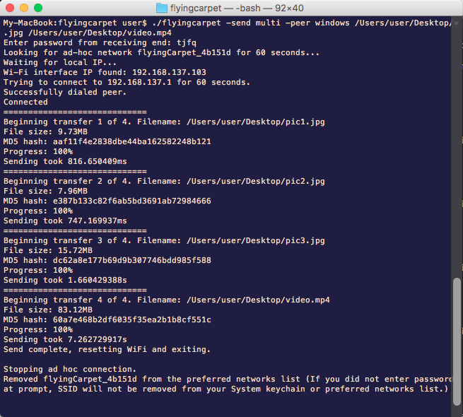

# Flying Carpet
Ready-to-use x64 `Flying Carpet.app.zip` (for Mac) and `Flying Carpet.exe` (for Windows) in !

Wireless, encrypted file transfer over automatically configured ad hoc networking. No network infrastructure required (access point, router, switch). Just two laptops (Mac and/or Windows) with wireless chips in close range.

Don't have a flash drive? Don't have access to a wireless network or don't trust one? Need to move a file larger than 2GB between Mac and Windows but don't want to set up a file share? Try it out!

# Screenshots:

  

# Features:
+ Cross-platform, Mac and Windows.

+ Speeds over 120mbps (with laptops close together).

+ Does not use Bluetooth or your local network, just wireless chip to wireless chip.

+ Files encrypted in transit.

+ Large files supported (<10MB RAM usage while transferring a 4.5GB file).

+ Standalone binary, no installation required.

# Compilation instructions:

+ Install wxGo. For Windows, I recommend the tdm-gcc link from this page rather than mingw-w64: https://github.com/dontpanic92/wxGo/wiki/Installation-Guide.

+ `go get -x github.com/spieglt/flyingcarpet`

+ `go build`

# Restrictions:
+ Disables your wireless internet connection while in use (does not apply to Windows when receiving)

+ On Mac: May have to click Allow or enter username and password at prompt to join ad-hoc network and clear Flying Carpet SSID from your preferred networks list.

+ On Windows: Must run as administrator to receive files (to allow connection through firewall and clear ARP cache). Right-click flyingcarpet.exe and select "Run as administrator."

+ After a successful transfer, Flying Carpet will attempt to rejoin you to your previous wireless networks. If there is an error midway through the process, this may fail.

# Planned features:

+ Linux support

+ Sending filename and size before transfer begins so user does not have to select filename and receiving end can have a progress bar

+ Cancel button

+ Get back-to-back transfers working without reopening program

+ Rewrite Wi-Fi Direct C++ code (currently using sample utility from Microsoft)

+ Make an icon

Disclaimer: I am not a cryptography expert. This is a usable product in its current state, but is also an experiment and a work in progress. Do not use for private files if you think a skilled attacker is less than 100 feet from you and trying to intercept them.

Licenses for third-party tools and libraries used can be found in the "3rd_party_licenses" folder.

If you've used Flying Carpet, please send me feedback! Thank you for your interest!
