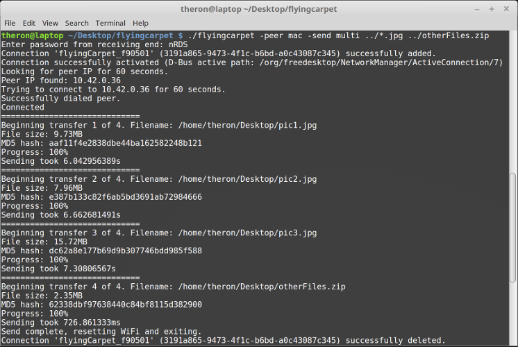

**Note: to send multiple files, use the `-send` flag with value `multi`, and then list however many files/globs after other flags. Standard shell character-escaping rules apply.**

**Linux/Mac example:**

`$ ./flyingcarpet -send multi -peer windows ../Documents/*.txt ../Desktop/video.mp4 "file name with spaces.jpg"`

**Windows example:**

`$ .\flyingcarpet.exe -send multi -peer linux ../Documents/*.txt ../Desktop/video.mp4 "file name with spaces.jpg"`

# Flying Carpet

Ready-to-use x64 `Flying Carpet (Linux CLI).zip`, `Flying Carpet (Mac CLI).zip`, and `Flying Carpet (Windows CLI).zip` in !

Wireless, encrypted file transfer over automatically configured ad hoc networking. No network infrastructure required (access point, router, switch). Just two laptops (Mac, Linux, and Windows supported) with wireless chips in close range.

Don't have a flash drive? Don't have access to a wireless network or don't trust one? Need to move a file larger than 2GB between different filesystems but don't want to set up a file share? Try it out!

# Screenshots:

    

# Features:

+ Cross-platform: Mac, Windows, and now Linux!

+ Transfer multiple files at once, without losing progress if the transfer is interrupted or canceled.

+ Speeds over 120mbps (with laptops close together).

+ Does not use Bluetooth or your local network, just wireless chip to wireless chip.

+ Files encrypted in transit.

+ Large files supported (<10MB RAM usage while transferring a 4.5GB file).

+ Standalone executable, no installation required and no dependencies needed.

+ Interoperable GUI and CLI versions.

# Compilation instructions:

+ Windows only: Compile WFD_DLL project with Visual Studio (Release, x64) and then run `makeIconSyso.bat` while in `icons/Windows` folder. Also install TDM-GCC (64-bit) (used for embedding icon in binary).

+ `go get -x github.com/spieglt/flyingcarpet`

+ Compile  and copy executable to `flyingcarpet` folder.

+ Run `.\rebuild.ps1` from Powershell (for Windows), `./rebuild_mac` from Terminal (for Mac), or `./rebuild_linux` (for Linux).

# Restrictions:

+ 64-bit only. Supported Operating Systems: macOS 10.12+, Windows 7+, and Linux Mint 18. I only have access to so many laptops, so if you've tried on other platforms please let me know whether it worked. 

+ Disables your wireless internet connection while in use (does not apply to Windows when receiving).

+ On Mac: May have to click Allow or enter username and password at prompt to clear Flying Carpet SSID from your preferred networks list. 

+ On Windows: Must run as administrator (to allow connection through firewall and clear ARP cache). Right-click Powershell or Command Prompt, select "Run as administrator", and navigate to the folder with `flyingcarpet.exe`. You may also need to disable WiFi Sense.

+ I need help testing on Linux and supporting non-Debian-based distributions! Currently only confirmed to work on Mint 18.

+ Flying Carpet should rejoin you to your previous wireless network after a completed or canceled transfer. This will not happen if the program freezes, crashes, or if the windows is closed during operation.

# Planned features:

+ Maybe warn about running as administrator upon start on Windows.

+ Replace `netsh wlan` with Native WiFi API on Windows.

Disclaimer: I am not a cryptography expert. Do not use for private files if you think a skilled attacker is less than 100 feet from you and trying to intercept them.

Licenses for third-party tools and libraries used can be found in the "3rd_party_licenses" folder.

If you've used Flying Carpet, please send me feedback! Thank you for your interest!
